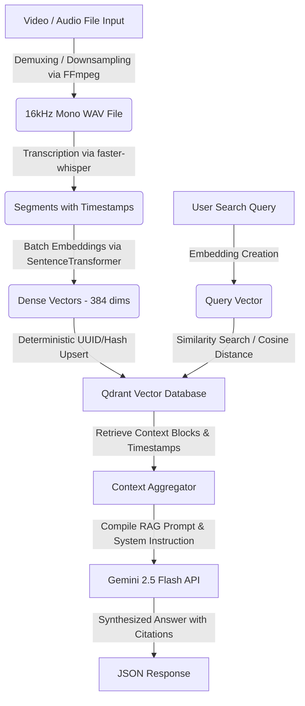

# LocalStream: Local Multimedia Semantic Search & RAG Engine

LocalStream is a self-hosted, multimodal multimedia semantic search and Retrieval-Augmented Generation (RAG) engine designed to run entirely locally (except for the final synthesis layer). It automatically extracts audio from uploaded videos, generates high-quality transcriptions with word-level timestamps using `faster-whisper`, embeds these transcript segments using `sentence-transformers`, stores them in a local `Qdrant` vector database, and serves a FastAPI query endpoint.

When a query is submitted, the engine searches the vector index for matching segments, constructs a structured prompt, and uses `gemini-2.5-flash` via the `google-genai` SDK to compile an answer containing precise timestamp citations.

---

## Key Features

- **Fully Self-Hosted Ingestion & Embedding**: Transcribe and index files locally without sending data to external APIs.
- **Auto-Demuxing & Mono Downsampling**: System-level `ffmpeg` extraction converts multi-channel audio or video files into a clean 16kHz mono `.wav` stream before transcribing.
- **Dynamic Compute Optimization**: Detects if `USE_GPU=1` is configured to run embedding/transcription on GPU via CUDA; otherwise falls back automatically to CPU utilizing `INT8` quantization for memory and speed efficiency.
- **Idempotent Vector Storage**: Employs SHA-256 deterministic integer hashing to ensure points are stored conflict-free and can be re-ingested idempotently.
- **Semantic Retrieval with Timestamp Citations**: Returns synthesis responses backed by exact timestamps mapped to source filenames (e.g., `[lecture_01.mp4 (00:15:32)]`).

---

## System Architecture



---

## Installation & Setup

### 1. System Dependencies
This service requires `ffmpeg` installed on your system.

**macOS**:
```bash
brew install ffmpeg
```

**Ubuntu/Debian**:
```bash
sudo apt update
sudo apt install ffmpeg
```

### 2. Environment Setup
Clone the repository and set up a Python virtual environment:

```bash
# Create python virtual environment
python3 -m venv venv
source venv/bin/activate

# Install requirements
pip install -r localstream/requirements.txt
```

Set your Gemini API Key in the environment:
```bash
export GEMINI_API_KEY="your-gemini-api-key-here"
```

*(Optional)* Enable GPU compute acceleration (requires CUDA compatible hardware/libs):
```bash
export USE_GPU=1
```

---

## Operating the Service

### 1. Launching the Web Server
Start the FastAPI server using `uvicorn`:

```bash
python3 -m uvicorn localstream.app:app --host 0.0.0.0 --port 8000 --reload
```

You can verify the system state by hitting the health check endpoint:
```bash
curl http://localhost:8000/health
```

### 2. Ingesting Multimedia Files
Send a POST request containing the absolute path to an audio or video file on your local machine:

```bash
curl -X POST http://localhost:8000/api/ingest \
  -H "Content-Type: application/json" \
  -d '{"file_path": "/Users/vashishtdevasani/Desktop/LocalStream/storage/uploads/sample_lecture.mp4"}'
```
*Note: The server returns `202 Accepted` immediately and processes transcription and indexing asynchronously in the background. Check application logs for progress.*

### 3. Querying Content (RAG)
Query the knowledge base using the semantic prompt:

```bash
curl -X POST http://localhost:8000/api/query \
  -H "Content-Type: application/json" \
  -d '{"prompt": "What does the speaker say about system architecture?", "limit": 3}'
```

#### Example Output Response
```json
{
  "query": "What does the speaker say about system architecture?",
  "answer": "The speaker explains that the system architecture is split into five distinct microservices to ensure loose coupling [sample_lecture.mp4 (00:04:12)]. The central hub orchestrates these components using a message queue system [sample_lecture.mp4 (00:05:45)].",
  "references": [
    {
      "filename": "sample_lecture.mp4",
      "file_path": "/Users/vashishtdevasani/Desktop/LocalStream/storage/uploads/sample_lecture.mp4",
      "start_timestamp": "00:04:12",
      "end_timestamp": "00:04:45",
      "start_seconds": 252.0,
      "text": "we decided to split the architecture into five distinct microservices to ensure that they are loosely coupled.",
      "score": 0.8123
    },
    ...
  ]
}
```

---

## Codebase Directory Structure
```text
localstream/
├── requirements.txt      # Pinned dependency manifest
├── config.py            # Pydantic Settings & directory auto-creation
├── transcribe.py        # FFMPEG audio extractor & faster-whisper worker
├── database.py          # Qdrant vector client & SentenceTransformer indexing
└── app.py               # FastAPI application layer & Gemini context synthesizer
storage/                 # Automatically created local folders
├── uploads/             # Place target audio/video source files here
└── qdrant_data/         # Embedded local Qdrant sqlite-based database data
```
