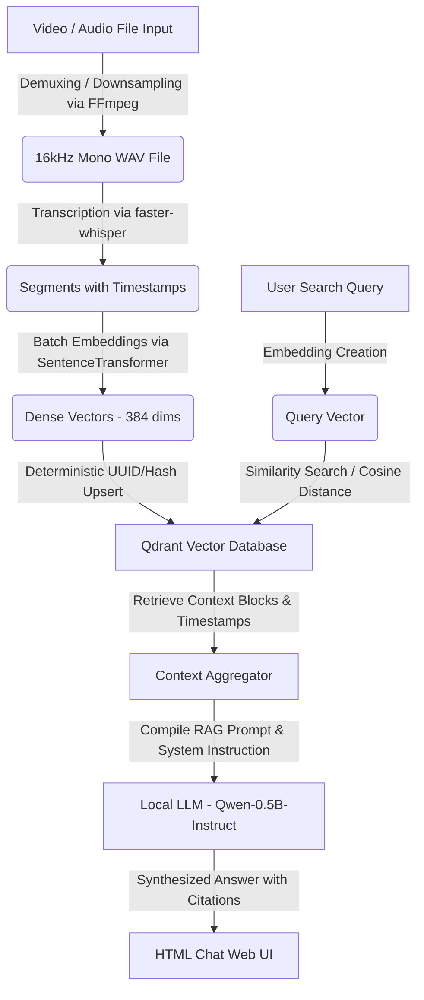

# LocalStream: 100% Local Multimedia Semantic Search & RAG Engine

LocalStream is a self-hosted, multimodal multimedia semantic search and Retrieval-Augmented Generation (RAG) engine designed to run **entirely locally**. The system does not transmit any data to cloud services. It automatically extracts audio from uploaded videos, generates high-quality transcriptions with word-level timestamps using `faster-whisper`, embeds these transcript segments using `sentence-transformers`, stores them in a local `Qdrant` vector database, and synthesizes final answers using a lightweight **local LLM** (`Qwen/Qwen2.5-0.5B-Instruct`).

The service serves a modern, premium **glassmorphic chat interface** directly from the root route (`http://localhost:8000/`) so that you can ingest media files and chat with them in real-time.

---

## Key Features

- **100% Local Execution**: Ingestion, transcription, embedding, vector storage, and response synthesis are executed fully offline on your own machine. No external APIs or keys needed!
- **Interactive Glassmorphic Web UI**: A polished dark-mode chat interface with system health meters, live background task tracking, and clickable citation tags.
- **Auto-Demuxing & Mono Downsampling**: System-level `ffmpeg` extraction converts multi-channel audio or video files into a clean 16kHz mono `.wav` stream before transcribing.
- **Dynamic Compute Optimization**: Detects if `USE_GPU=1` is configured to run embedding, transcription, and LLM inference on GPU via CUDA; otherwise falls back automatically to CPU utilizing `INT8` quantization for memory and speed efficiency.
- **Idempotent Vector Storage**: Employs SHA-256 deterministic integer hashing to ensure points are stored conflict-free and can be re-ingested idempotently.
- **Semantic Retrieval with Timestamp Citations**: Returns synthesis responses backed by exact timestamps mapped to source filenames (e.g., `[lecture_01.mp4 (00:15:32)]`).

---

## System Architecture



---

## Installation & Setup

### 1. System Dependencies
This service requires `ffmpeg` installed on your system.

**macOS**:
```bash
brew install ffmpeg
```

**Ubuntu/Debian**:
```bash
sudo apt update
sudo apt install ffmpeg
```

### 2. Environment Setup
Clone the repository and set up a Python virtual environment:

```bash
# Create python virtual environment
python3 -m venv venv
source venv/bin/activate

# Install requirements
pip install -r localstream/requirements.txt
```

*(Optional)* Enable GPU compute acceleration (requires CUDA compatible hardware/libs):
```bash
export USE_GPU=1
```

---

## Operating the Service

### 1. Launching the Web Server
Start the FastAPI server using `uvicorn`:

```bash
python3 -m uvicorn localstream.app:app --host 0.0.0.0 --port 8000 --reload
```
*Note: On first startup, the server will automatically download the local embedding model (`all-MiniLM-L6-v2`) and the local LLM (`Qwen/Qwen2.5-0.5B-Instruct`). This may take a few minutes depending on your internet connection.*

### 2. Accessing the Web Interface
Once the server started successfully, open your browser and navigate to:
👉 **[http://localhost:8000/](http://localhost:8000/)**

The interface allows you to:
- Monitor status (device, loaded models, Qdrant status).
- Ingest local media files by pasting their absolute paths.
- Ask natural questions in the chat window, click citations, and inspect source reference chunks.

### 3. API Commands (Alternative)
You can still interact with the backend programmatically if desired:

**Ingest File**:
```bash
curl -X POST http://localhost:8000/api/ingest \
  -H "Content-Type: application/json" \
  -d '{"file_path": "/absolute/path/to/sample.mp4"}'
```

**Query RAG**:
```bash
curl -X POST http://localhost:8000/api/query \
  -H "Content-Type: application/json" \
  -d '{"prompt": "What does the speaker say about system architecture?", "limit": 3}'
```

---

## Codebase Directory Structure
```text
localstream/
├── requirements.txt      # Dependency manifest (includes torch & transformers)
├── config.py            # Settings configuration (default LLM: Qwen-0.5B)
├── transcribe.py        # FFmpeg audio extractor & faster-whisper worker
├── database.py          # Qdrant client & SentenceTransformer indexing
├── app.py               # FastAPI application, local LLM generation, & root handler
└── index.html           # Glassmorphic chat client frontend UI
storage/                 # Automatically created local folders
├── uploads/             # Extracted video audio files (.wav)
└── qdrant_data/         # Local Qdrant embedded database
```
